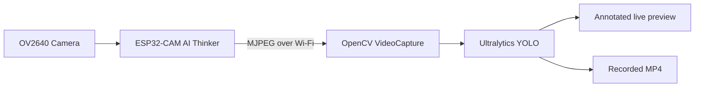

# ESP32-CAM YOLO Object Detection


Real-time object detection using an **AI Thinker ESP32-CAM** as a wireless camera and a host computer running **Ultralytics YOLO** inference.

The ESP32-CAM captures JPEG frames and publishes an MJPEG stream over Wi-Fi. A Python application running on the host receives the stream, performs object detection, displays the annotated video, and can record the results as MP4.

> The neural network runs on the host computer. The ESP32-CAM handles image capture and network streaming.

## Demo

[▶️ Watch the object detection demonstration](docs/assets/esp32_yolo_2026-07-25_15-09-14.mp4)

The video shows the ESP32-CAM transmitting an MJPEG stream over Wi-Fi while Ultralytics YOLO performs real-time object detection on the host computer, displaying bounding boxes, class labels, confidence scores, and FPS.


## Architecture



## Features

- MJPEG streaming from the ESP32-CAM
- JPEG snapshot endpoint at `/jpg`
- Browser preview interface
- Flash LED control and remote restart
- YOLO object detection on the host computer
- Bounding boxes, class labels, confidence scores, and FPS
- Optional MP4 recording
- Graceful shutdown with `q` or `Ctrl+C`
- Wi-Fi credentials excluded from version control

## Hardware

| Component | Specification |
|---|---|
| Development board | AI Thinker ESP32-CAM |
| Camera sensor | OV2640 |
| External memory | PSRAM |
| Programmer and power board | ESP32-CAM-MB with USB-C |
| Network | 2.4 GHz Wi-Fi |
| Inference host | Computer running Arch Linux |
| Optional acceleration | NVIDIA GPU with compatible PyTorch/CUDA |

## Software and Technologies

- Arduino IDE 2.x
- Arduino Core for ESP32 by Espressif Systems
- C++ / Arduino
- Python
- OpenCV
- Ultralytics YOLO
- MJPEG over HTTP
- FFmpeg
- Arch Linux
- Git and GitHub

## Repository Structure

```text
esp32-cam-yolo-object-detection/
├── firmware/
│   └── esp32_cam_stream/
│       ├── esp32_cam_stream.ino
│       └── secrets.example.h
├── pc_inference/
│   └── detect.py
├── models/
│   └── README.md
├── captures/
├── results/
├── docs/
│   ├── ARCHITECTURE.md
│   ├── LINKEDIN_POST.pt-BR.md
│   └── assets/
├── scripts/
│   └── convert_video.sh
├── .gitignore
├── LICENSE
├── requirements.txt
└── README.md
```

Open `firmware/esp32_cam_stream/esp32_cam_stream.ino` in Arduino IDE edit wifi.

### Arduino IDE Settings

```text
Board: AI Thinker ESP32-CAM
Upload Speed: 115200
CPU Frequency: 240 MHz
Flash Frequency: 80 MHz
Flash Mode: QIO
Partition Scheme: Huge APP
PSRAM: Enabled
Serial Monitor: 115200 baud
```

Install the official package `esp32 by Espressif Systems`. No separate `esp_camera` library is required.

After uploading, the serial monitor prints addresses similar to:

```text
Page:     http://192.168.0.113
Snapshot: http://192.168.0.113/jpg
Stream:   http://192.168.0.113/stream
```

## 2. Configure Python

```bash
python -m venv .venv
source .venv/bin/activate
python -m pip install --upgrade pip
pip install -r requirements.txt
```

Optional packages for Arch Linux:

```bash
sudo pacman -S --needed ffmpeg xorg-xwayland ttf-dejavu
```

## 3. Add the YOLO Model

Place the model at:

```text
models/yolo26n.pt
```

Model files are ignored by Git.

## 4. Run Live Inference

Close any browser tab already using `/stream` because the firmware allows one active stream client.

```bash
python pc_inference/detect.py \
  --source http://192.168.0.113/stream \
  --model models/yolo26n.pt \
  --imgsz 320 \
  --conf 0.35
```

Press `q` while the video window is focused, or use `Ctrl+C` in the terminal.

## 5. Record the Result

```bash
python pc_inference/detect.py \
  --source http://192.168.0.113/stream \
  --model models/yolo26n.pt \
  --imgsz 320 \
  --conf 0.35 \
  --save
```

Recordings are stored in `results/`.

Choose a custom filename:

```bash
python pc_inference/detect.py \
  --source http://192.168.0.113/stream \
  --model models/yolo26n.pt \
  --imgsz 320 \
  --conf 0.35 \
  --save \
  --output results/demo.mp4
```

## 6. Convert for Social Media

```bash
bash scripts/convert_video.sh results/demo.mp4 results/demo_social.mp4
```

## HTTP Endpoints

| Route | Description |
|---|---|
| `/` | Browser camera interface |
| `/jpg` | Current JPEG snapshot |
| `/stream` | MJPEG live stream |
| `/flash?onoff=toggle` | Toggle flash LED |
| `/flash?onoff=on` | Turn flash on |
| `/flash?onoff=off` | Turn flash off |
| `/restart` | Restart the ESP32-CAM |

## Default Camera Configuration

```text
Resolution: VGA, 640 x 480
Pixel format: JPEG
JPEG quality: 15
Framebuffer count: 1
Framebuffer location: PSRAM
Grab mode: latest frame
Horizontal mirror: enabled
Wi-Fi power saving: disabled
HTTP port: 80
```

## Security

Never commit Wi-Fi credentials, private tokens, or personal recordings. The real `secrets.h` file is ignored by Git.

If a password has already appeared in source code or screenshots, change it before publishing the repository.

## Limitations

- YOLO runs on the host, not on the classic ESP32-CAM.
- The ESP32-CAM and host must be reachable on the same network.
- Stream performance depends on Wi-Fi quality.
- The current firmware accepts one active MJPEG stream client.
- Image quality and frame rate are limited by the OV2640 and ESP32-CAM.

## Roadmap

- Automatic stream reconnection
- Web dashboard for detections
- JSON or CSV detection logs
- Event-based recording
- MQTT or REST notifications
- Docker support
- CPU and GPU benchmarks
- Custom object detection training
- ESP32-S3 evaluation

## Author

**Miguel Gengo**

- GitHub: [Gengo250](https://github.com/Gengo250)

## License

MIT License.
